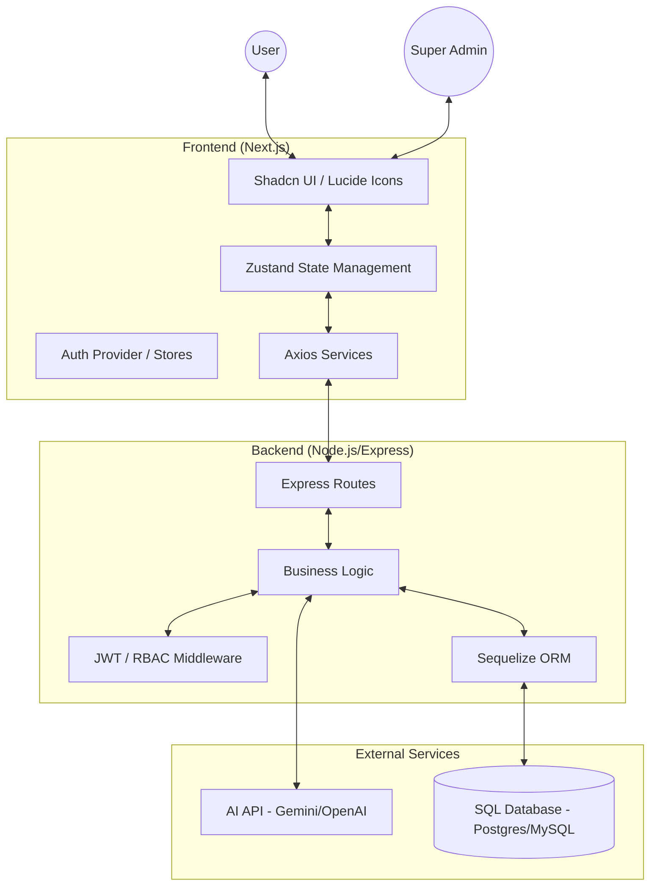

# FormFlow AI - Advanced Drag-and-Drop SaaS Form Builder

FormFlow AI is a comprehensive SaaS platform designed to create, manage, and analyze intelligent forms with ease. It combines a powerful drag-and-drop interface with AI-powered generation and real-time analytics to provide a seamless data collection experience.

## 🚀 Key Features

- **Intuitive Drag-and-Drop Builder**: Build complex forms effortlessly without writing a single line of code.
- **AI Form Generation**: Describe your needs, and let our AI generate a complete form structure in seconds.
- **Real-time Analytics**: Track submissions, completion rates, and user behavior with beautiful built-in charts.
- **SaaS Tiered Subscriptions**: Built-in support for Free, Pro, and Enterprise plans with feature-based limits.
- **Super Admin Dashboard**: Full control over users, roles, payments, and system integrity.
- **Responsive Design**: All forms and dashboards are fully optimized for mobile, tablet, and desktop.
- **Seamless Publishing**: Publish forms to a hosted URL or embed them into any website with ease.

---

## 🏗️ Architecture Overview

The project follows a modern full-stack architecture with a clear separation between the frontend and backend.



---

## 💾 Database Schema

The system uses a relational database structure managed via Sequelize ORM.

### 1. User Model

| Field      | Type    | Description                       |
| :--------- | :------ | :-------------------------------- |
| `id`       | UUID    | Primary Key                       |
| `name`     | String  | Full name of the user             |
| `email`    | String  | Unique email (Username)           |
| `password` | String  | Hashed password (Bcrypt)          |
| `role`     | ENUM    | `user`, `admin`, `super-admin`    |
| `plan`     | ENUM    | `free`, `pro`, `enterprise`       |
| `maxForms` | Integer | Form creation limit based on plan |

### 2. Form Model

| Field         | Type   | Description                                   |
| :------------ | :----- | :-------------------------------------------- |
| `id`          | UUID   | Primary Key                                   |
| `title`       | String | Form title                                    |
| `description` | Text   | Optional form description                     |
| `status`      | ENUM   | `draft`, `active`, `archived`                 |
| `fields`      | JSON   | Array of form components (label, type, rules) |
| `settings`    | JSON   | Submission rules, messages, and flow settings |
| `theme`       | JSON   | Visual styles (colors, fonts, radius)         |
| `userId`      | UUID   | Foreign Key (Owner)                           |

### 3. Submission Model

| Field         | Type | Description             |
| :------------ | :--- | :---------------------- |
| `id`          | UUID | Primary Key             |
| `formId`      | UUID | Foreign Key             |
| `data`        | JSON | Captured form responses |
| `submittedAt` | Date | Timestamp of submission |

### 4. Plan Model

| Field      | Type    | Description                    |
| :--------- | :------ | :----------------------------- |
| `id`       | UUID    | Primary Key                    |
| `name`     | String  | Plan name (e.g., "Pro")        |
| `price`    | Decimal | Monthly subscription fee       |
| `maxForms` | Integer | Limit associated with the plan |
| `features` | JSON    | List of enabled feature flags  |

---

## 🛠️ Technology Stack

### Frontend

- **Framework**: Next.js 14+ (App Router)
- **Styling**: Tailwind CSS
- **Components**: Shadcn UI / Radix UI
- **Icons**: Lucide React
- **Animations**: Framer Motion
- **State Management**: Zustand
- **Forms**: React Hook Form / Zod

### Backend

- **Runtime**: Node.js
- **Framework**: Express.js
- **ORM**: Sequelize
- **Authentication**: JWT (JSON Web Tokens)
- **Security**: Bcrypt.js, Helmet, CORS
- **Database**: PostgreSQL / MySQL / SQLite (Configurable)

---

## 🚦 Project Flow

1. **Authentication**: Users sign up and are assigned to the `Free` plan by default.
2. **Form Creation**:
   - User builds a form via the **Drag & Drop Builder** OR generates one using **AI**.
   - The form structure is stored as a JSON blob in the `fields` column.
3. **Publishing**: Once satisfied, the user changes the form status to `active`.
4. **Data Collection**:
   - Public users visit the unique form URL and submit data.
   - Submissions are validated against the form's rules and stored in the `Submissions` table.
5. **Analytics**: The creator views aggregated data and performance metrics in their dashboard.
6. **Management**: Super Admins monitor platform health and user tiers via the Admin panel.

---

## 📦 Getting Started

### Prerequisites

- Node.js (v18+)
- SQL Database (Postgres recommended)
- API keys for AI services (optional)

### Installation

1. **Clone the repository**

   ```bash
   git clone <repo-url>
   cd draganddrop
   ```

2. **Setup Backend**

   ```bash
   cd saas_backend
   npm install
   # Create .env file with DB_URL, JWT_SECRET, etc.
   npm run dev
   ```

3. **Setup Frontend**
   ```bash
   cd saa-s-form-builder
   npm install
   # Create .env.local with NEXT_PUBLIC_API_URL
   npm run dev
   ```

---

## 📄 License

This project is licensed under the MIT License - see the [LICENSE](LICENSE) file for details.
